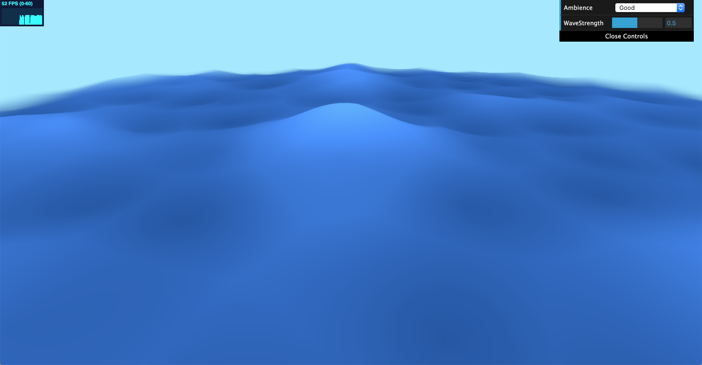

# Noisy Terrain: A Moody Ocean
Name: Crystal Lee
PennKey: leecr
Email: leecr@seas.upenn.edu
[Website](www.crystaljlee.com)

## Live Project Demo
[Link](link)

## Project Description
A procedurally generated ocean terrain created using a custom shader. It incorporates different noise functions and noise function permutations to deform the surface and modify the color of the subdivided plane to give it the appearance of a flowing ocean.

The two primary noise functions used in this project are Perlin noise and Worley noise. The noise function implementations were inspired by open-source implementations by Stefan Gustavson. 

The waves of the ocean were created through two recursions of Perlin noise and an exponential function to make the peaks of the waves higher. Worley noise was then added onto the waves to create smaller dips and grooves in the water and give it a more natural look.

To create the illusion of the natural ebbs and flows of the ocean surface, sin and cosine functions are used to displace the water's x and y coordinates in a periodic manner.

There is also a provided GUI that allows the user to change certain aspects of the terrain. The "ambience" field changes the color of the water and the atmosphere of the scene - hence the name of "moody" ocean :) The moods available are Good (a normal blue ocean with a calming atmosphere), Evil (a dark red ocean that looks like lava with a forboding atmosphere), and Morally Ambiguous (a dark purple ocean with a mysterious atmosphere). In addition, the user can also change the wave strength, which influences how quickly the water ebbs and flows.

Click on the live demo to see it in action!

## References
[Perlin Noise GLSL implementations](https://gist.github.com/patriciogonzalezvivo/670c22f3966e662d2f83)
[Worley Noise GLSL implementations](https://github.com/Erkaman/glsl-worley)
[The Book of Shaders](https://thebookofshaders.com)